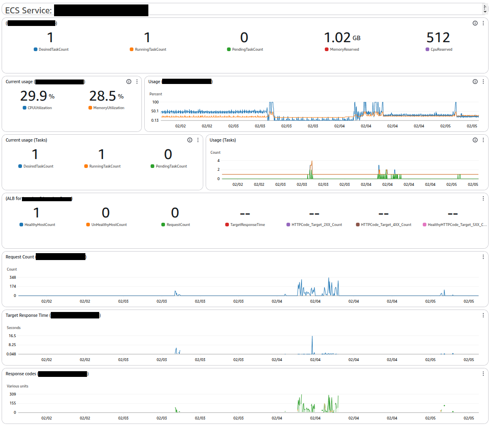

# ECS dashboard

Provides basic metrics for ECS Services
Those include:
* Number of tasks used over time
* CPU & Memory utilization
* Load Balancer traffic, response code and response time

## Example
```
module "dashboard" {
  source = "github.com/letsgodevops/terraform-aws-cloudwatch//modules/dashboards/ecs"

  section_name = "My service"
  name         = "My service - Main application"

  cluster_id   = aws_ecs_service.this.cluster
  service_name = aws_ecs_service.this.name

  alb_target_group_arn = aws_lb_target_group.this.arn
}
```


## Preview
 
