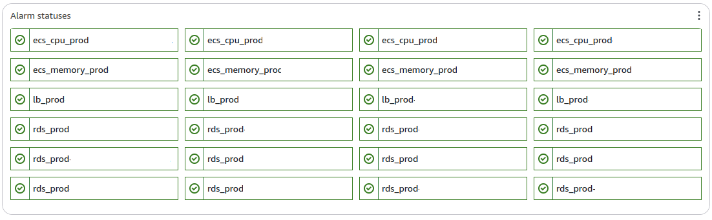
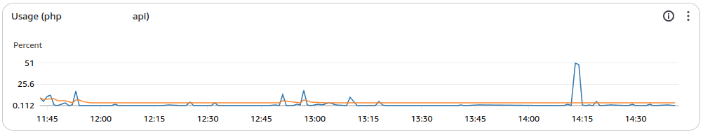
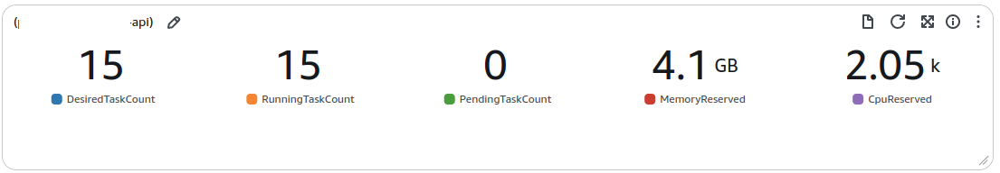
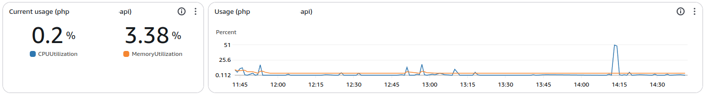
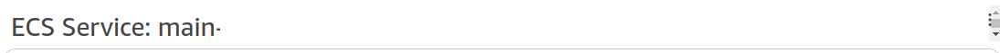

# Cloudwatch dashboards widgets

Set of modules that create json-alike objects to create robust CloudWatch dashboards.

## Alarms
List alarms with their statuses

## Chart
Shows chart for all the metrics

## Value
Shows most recent values for the metrics
 

## Value-Chart
Line containing most recent value & chart of historical values.
It can be used to plot multiple values

# Text
Adds text separator with given data
 

